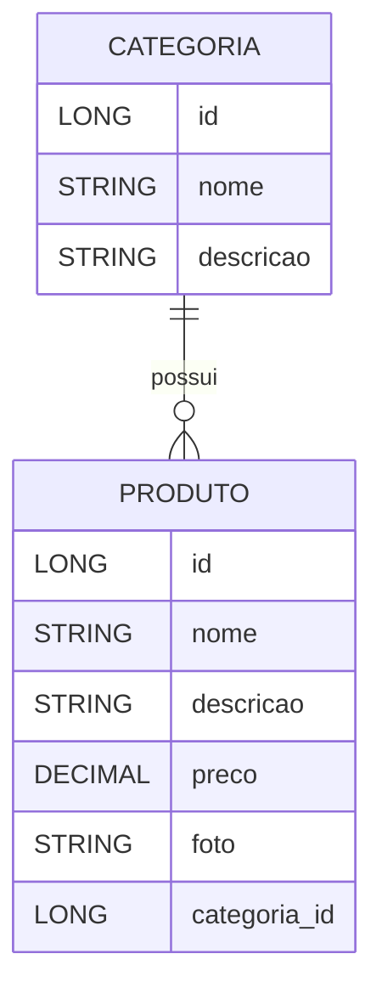

# 💊 Projeto Farmácia — Spring Boot

Este é um projeto **em desenvolvimento**, criado com fins **didáticos e fictícios**, representando o backend de uma **Farmácia Online** construída com **Java Spring Boot**.  
O sistema tem como objetivo o **gerenciamento de produtos farmacêuticos e suas categorias**, permitindo o cadastro, listagem, atualização e exclusão de registros.  

O projeto também conta com um **DER (Diagrama Entidade-Relacionamento)** que ilustra as conexões entre as entidades **Produto** e **Categoria**.

---

## 🧩 Estrutura das Entidades

### **Categoria**
Representa os diferentes tipos ou seções da farmácia, como medicamentos, cosméticos, suplementos, etc.

| Atributo | Tipo | Descrição |
|-----------|------|-----------|
| `id` | Long | Identificador único da categoria |
| `nome` | String | Nome da categoria (ex: Medicamentos, Cuidados Pessoais) |
| `descricao` | String | Descrição da categoria |
| `produtos` | List<Produto> | Lista de produtos vinculados à categoria |

---

### **Produto**
Representa os produtos disponíveis na farmácia.

| Atributo | Tipo | Descrição |
|-----------|------|-----------|
| `id` | Long | Identificador único do produto |
| `nome` | String | Nome do produto |
| `descricao` | String | Breve descrição do produto |
| `preco` | BigDecimal | Preço de venda do produto |
| `foto` | String | URL da imagem do produto |
| `categoria` | Categoria | Categoria associada ao produto |

---

## 🔗 Relacionamento entre as entidades

O relacionamento entre as entidades é do tipo:

```
Categoria (1) —— (N) Produto
```

Ou seja, uma **categoria** pode conter **vários produtos**, mas cada **produto** pertence a **apenas uma categoria**.

---

## 🧮 DER — Diagrama Entidade Relacionamento



> 💡 O diagrama acima mostra o relacionamento **One-to-Many** entre as tabelas `categoria` e `produto`.

---

## 🚀 Tecnologias Utilizadas

- **Java 17+**
- **Spring Boot 3+**
- **Spring Web**
- **Spring Data JPA**
- **Hibernate**
- **H2 Database** (banco de dados em memória)
- **Jakarta Validation**
- **Swagger / Springdoc OpenAPI** (documentação da API)
- **Maven**

---

## ⚙️ Como Executar o Projeto

1. **Clone o repositório:**
   ```bash
   git clone https://github.com/seuusuario/farmacia.git
   ```

2. **Acesse o diretório do projeto:**
   ```bash
   cd farmacia
   ```

3. **Execute o projeto:**
   ```bash
   mvn spring-boot:run
   ```
   Ou execute a classe principal `FarmaciaApplication.java` na sua IDE.

4. **Acesse a aplicação:**
   - API: [http://localhost:8080](http://localhost:8080)
   - Swagger UI: [http://localhost:8080/swagger-ui.html](http://localhost:8080/swagger-ui.html)

---

## 📄 Endpoints Principais

### **Categorias**
| Método | Endpoint | Descrição |
|--------|-----------|-----------|
| `GET` | `/categorias` | Lista todas as categorias |
| `GET` | `/categorias/{id}` | Busca uma categoria pelo ID |
| `GET` | `/categorias/nome/{nome}` | Busca uma categoria pelo nome |
| `POST` | `/categorias` | Cadastra uma nova categoria |
| `PUT` | `/categorias` | Atualiza uma categoria existente |
| `DELETE` | `/categorias/{id}` | Exclui uma categoria pelo ID |

---

### **Produtos**
| Método | Endpoint | Descrição |
|--------|-----------|-----------|
| `GET` | `/produtos` | Lista todos os produtos |
| `GET` | `/produtos/{id}` | Busca um produto pelo ID |
| `GET` | `/produtos/nome/{nome}` | Busca um produto pelo nome |
| `POST` | `/produtos` | Cadastra um novo produto |
| `PUT` | `/produtos` | Atualiza um produto existente |
| `DELETE` | `/produtos/{id}` | Exclui um produto pelo ID |

---

## 💡 Observações

- Este é um **projeto fictício**, desenvolvido com o objetivo de **praticar o uso do Spring Boot e mapeamento JPA**.  
- O **relacionamento One-to-Many/Many-to-One** foi utilizado para consolidar o entendimento de banco de dados relacional.  
- O projeto segue boas práticas de **arquitetura em camadas (Controller, Service, Repository)**.

---

## 🧑‍💻 Autor

**Andressa Funes**  
Projeto desenvolvido para fins de estudo em **Java e Spring Boot**.
