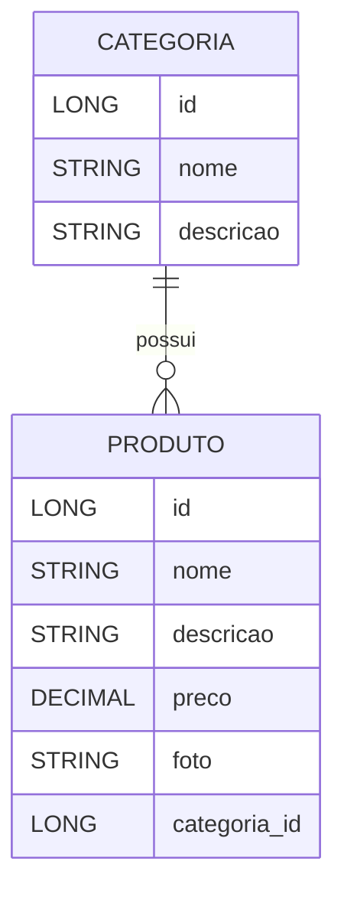

🏥 Farmácia - Projeto Spring Boot

Este projeto faz parte do aprendizado com **Spring Boot** e representa uma **API REST** para uma farmácia fictícia.  
A aplicação foi construída utilizando boas práticas de desenvolvimento, autenticação JWT e testes automatizados.

---

## 🧾 Descrição do Projeto

O sistema **Farmácia** foi desenvolvido para gerenciar **produtos** e **categorias**, além de contar com a **gestão de usuários** com autenticação segura via JWT.  
A aplicação permite o cadastro, atualização, listagem e exclusão de produtos, garantindo que apenas usuários autenticados possam realizar certas operações.

---

## 💊 Entidades do Sistema

### 🧩 Categoria

Representa a classificação dos produtos.

| Atributo  | Tipo   | Descrição                        |
| --------- | ------ | -------------------------------- |
| id        | Long   | Identificador único da categoria |
| nome      | String | Nome da categoria                |
| descrição | String | Descrição detalhada da categoria |

---

### 💼 Produto

Representa os produtos disponíveis na farmácia.

| Atributo  | Tipo       | Descrição                       |
| --------- | ---------- | ------------------------------- |
| id        | Long       | Identificador único do produto  |
| nome      | String     | Nome do produto                 |
| descrição | String     | Detalhes sobre o produto        |
| preço     | BigDecimal | Valor do produto                |
| categoria | Categoria  | Relação ManyToOne com Categoria |

---

### 👤 Usuário

Responsável pela autenticação e autorização dentro do sistema.

| Atributo | Tipo   | Descrição                              |
| -------- | ------ | -------------------------------------- |
| id       | Long   | Identificador único do usuário         |
| nome     | String | Nome completo                          |
| usuario  | String | E-mail ou nome de login                |
| senha    | String | Senha criptografada                    |
| foto     | String | URL contendo o link da foto do usuário |

---

## 🔗 Relacionamentos

O projeto utiliza relacionamentos entre as entidades:

- **Categoria** 1️⃣ ➜ N️⃣ **Produto** (Um para muitos)  
- **Usuário** possui autenticação via **JWT**  
- **Produto** pertence a uma **Categoria**

---

## ⚙️ Tecnologias Utilizadas

- **Java 17+**  
- **Spring Boot 3+**  
- **Spring Web**  
- **Spring Data JPA**  
- **Spring Security + JWT**  
- **H2 Database** (para testes)  
- **MySQL** (para ambiente de produção)  
- **JUnit 5 e Spring Test** (para testes automatizados)  
- **Render** (para deploy da aplicação)

---

## 🔒 Segurança - Spring Security & JWT

O projeto implementa **autenticação e autorização** com **Spring Security**.  
Os usuários realizam login e recebem um **token JWT**, que deve ser incluído no cabeçalho das requisições para acessar endpoints protegidos.

Exemplo de cabeçalho:

```
Authorization: Bearer <seu_token_jwt>
```

---

## 🧪 Testes Automatizados

Os testes foram desenvolvidos utilizando **JUnit 5** e **Spring Boot Test**, abrangendo:

- Testes de **CRUD de Produto** e **Categoria**
- Testes de **Autenticação e Usuário**
- Verificação dos **status HTTP** e **corpo da resposta**
- Testes de integração com o banco H2

As classes de teste seguem o padrão:

```
src/test/java/com/generation/farmacia/controller/
```

---

## 🧰 Como Executar o Projeto Localmente

1. Clone o repositório:

   ```bash
   git clone https://github.com/andressafunes/farmacia.git
   ```

2. Acesse a pasta do projeto:

   ```bash
   cd farmacia
   ```

3. Configure o banco de dados no arquivo `application.properties`.

4. Execute o projeto:

   ```bash
   mvn spring-boot:run
   ```

5. Acesse a aplicação:

   ```
   http://localhost:8080
   ```

---

## 🌐 Deploy no Render

A aplicação foi implantada na plataforma **Render**, permitindo acesso público à API.

🔗 **Acesse o projeto online:**  
👉 [https://projeto-final-bloco-02-e3dk.onrender.com](https://projeto-final-bloco-02-e3dk.onrender.com)

O processo de deploy foi feito diretamente a partir do repositório GitHub.  
Ao realizar **push** ou **merge** na branch configurada (geralmente `main`), o Render executa o **build** e **publica automaticamente** a nova versão da aplicação.

---

## 🧭 Endpoints Principais

### Categoria

| Método | Endpoint           | Descrição                        |
| ------ | ------------------ | -------------------------------- |
| GET    | `/categorias`      | Lista todas as categorias        |
| POST   | `/categorias`      | Cadastra uma nova categoria      |
| PUT    | `/categorias`      | Atualiza uma categoria existente |
| DELETE | `/categorias/{id}` | Exclui uma categoria             |

### Produto

| Método | Endpoint                | Descrição                |
| ------ | ----------------------- | ------------------------ |
| GET    | `/produtos`             | Lista todos os produtos  |
| GET    | `/produtos/{id}`        | Busca produto por ID     |
| GET    | `/produtos/nome/{nome}` | Busca produtos pelo nome |
| POST   | `/produtos`             | Cadastra um novo produto |
| PUT    | `/produtos`             | Atualiza um produto      |
| DELETE | `/produtos/{id}`        | Deleta um produto        |

### Usuário / Auth

| Método | Endpoint              | Descrição                              |
| ------ | --------------------- | -------------------------------------- |
| POST   | `/usuarios/logar`     | Autentica um usuário e retorna o token |
| POST   | `/usuarios/cadastrar` | Cadastra um novo usuário               |

---

## 🧩 Diagrama de Entidade e Relacionamento (DER)

```
Categoria (1)───(N) Produto
     │
     │
Usuário (autenticação via JWT)
```

---

## 👩‍💻 Autora

**Andressa Funes**  
Projeto desenvolvido como parte dos estudos em **Spring Boot e APIs RESTful**.# 💊 Projeto Farmácia — Spring Boot

Este é um projeto **em desenvolvimento**, criado com fins **didáticos e fictícios**, representando o backend de uma **Farmácia Online** construída com **Java Spring Boot**.  
O sistema tem como objetivo o **gerenciamento de produtos farmacêuticos e suas categorias**, permitindo o cadastro, listagem, atualização e exclusão de registros.  

O projeto também conta com um **DER (Diagrama Entidade-Relacionamento)** que ilustra as conexões entre as entidades **Produto** e **Categoria**.

---

## 🧩 Estrutura das Entidades

### **Categoria**
Representa os diferentes tipos ou seções da farmácia, como medicamentos, cosméticos, suplementos, etc.

| Atributo | Tipo | Descrição |
|-----------|------|-----------|
| `id` | Long | Identificador único da categoria |
| `nome` | String | Nome da categoria (ex: Medicamentos, Cuidados Pessoais) |
| `descricao` | String | Descrição da categoria |
| `produtos` | List<Produto> | Lista de produtos vinculados à categoria |

---

### **Produto**
Representa os produtos disponíveis na farmácia.

| Atributo | Tipo | Descrição |
|-----------|------|-----------|
| `id` | Long | Identificador único do produto |
| `nome` | String | Nome do produto |
| `descricao` | String | Breve descrição do produto |
| `preco` | BigDecimal | Preço de venda do produto |
| `foto` | String | URL da imagem do produto |
| `categoria` | Categoria | Categoria associada ao produto |

---

## 🔗 Relacionamento entre as entidades

O relacionamento entre as entidades é do tipo:

```
Categoria (1) —— (N) Produto
```

Ou seja, uma **categoria** pode conter **vários produtos**, mas cada **produto** pertence a **apenas uma categoria**.

---

## 🧮 DER — Diagrama Entidade Relacionamento



> 💡 O diagrama acima mostra o relacionamento **One-to-Many** entre as tabelas `categoria` e `produto`.

---

## 🚀 Tecnologias Utilizadas

- **Java 17+**
- **Spring Boot 3+**
- **Spring Web**
- **Spring Data JPA**
- **Hibernate**
- **H2 Database** (banco de dados em memória)
- **Jakarta Validation**
- **Swagger / Springdoc OpenAPI** (documentação da API)
- **Maven**

---

## ⚙️ Como Executar o Projeto

1. **Clone o repositório:**
   ```bash
   git clone https://github.com/seuusuario/farmacia.git
   ```

2. **Acesse o diretório do projeto:**
   ```bash
   cd farmacia
   ```

3. **Execute o projeto:**
   ```bash
   mvn spring-boot:run
   ```
   Ou execute a classe principal `FarmaciaApplication.java` na sua IDE.

4. **Acesse a aplicação:**
   - API: [http://localhost:8080](http://localhost:8080)
   - Swagger UI: [http://localhost:8080/swagger-ui.html](http://localhost:8080/swagger-ui.html)

---

## 📄 Endpoints Principais

### **Categorias**
| Método | Endpoint | Descrição |
|--------|-----------|-----------|
| `GET` | `/categorias` | Lista todas as categorias |
| `GET` | `/categorias/{id}` | Busca uma categoria pelo ID |
| `GET` | `/categorias/nome/{nome}` | Busca uma categoria pelo nome |
| `POST` | `/categorias` | Cadastra uma nova categoria |
| `PUT` | `/categorias` | Atualiza uma categoria existente |
| `DELETE` | `/categorias/{id}` | Exclui uma categoria pelo ID |

---

### **Produtos**
| Método | Endpoint | Descrição |
|--------|-----------|-----------|
| `GET` | `/produtos` | Lista todos os produtos |
| `GET` | `/produtos/{id}` | Busca um produto pelo ID |
| `GET` | `/produtos/nome/{nome}` | Busca um produto pelo nome |
| `POST` | `/produtos` | Cadastra um novo produto |
| `PUT` | `/produtos` | Atualiza um produto existente |
| `DELETE` | `/produtos/{id}` | Exclui um produto pelo ID |

---

## 💡 Observações

- Este é um **projeto fictício**, desenvolvido com o objetivo de **praticar o uso do Spring Boot e mapeamento JPA**.  
- O **relacionamento One-to-Many/Many-to-One** foi utilizado para consolidar o entendimento de banco de dados relacional.  
- O projeto segue boas práticas de **arquitetura em camadas (Controller, Service, Repository)**.

---

## 🧑‍💻 Autor

**Andressa Funes**  
Projeto desenvolvido para fins de estudo em **Java e Spring Boot**.
